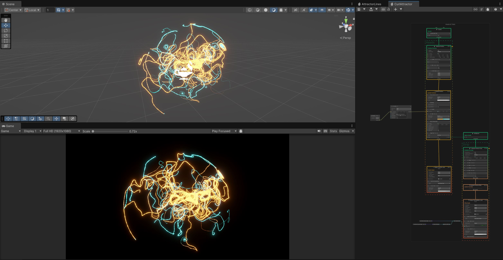
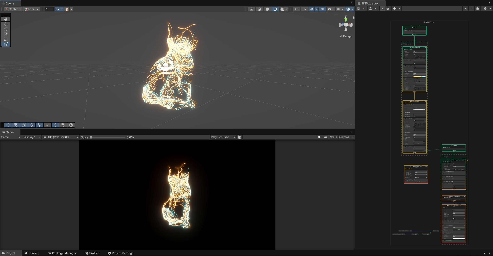

# MuVisionArt

Several 3D art models made for MuVision.

MuVision:
* https://muvision.com/
* https://linktr.ee/muvision_en

Dependencies:
* Unity 6. Packages: https://github.com/lorentzo/MuVisionArt/tree/main/UnityArt/Packages
* Unity 2021. Packages: https://github.com/lorentzo/MuVisionArt/tree/main/UnityArt/Packages

# Unity Art 1: Attractor Lines

VFX Graph Asset: https://github.com/lorentzo/MuVisionArt/tree/main/UnityArt/Assets/ArtAssets/AttractorLines

# Unity Art 2: Curl Attractor

VFX Graph Asset: https://github.com/lorentzo/MuVisionArt/tree/main/UnityArt/Assets/ArtAssets/CurlAttractor

# Unity Art 3: SDF Attractor

VFX Graph Asset: https://github.com/lorentzo/MuVisionArt/tree/main/UnityArt/Assets/ArtAssets/SDFAttractor

